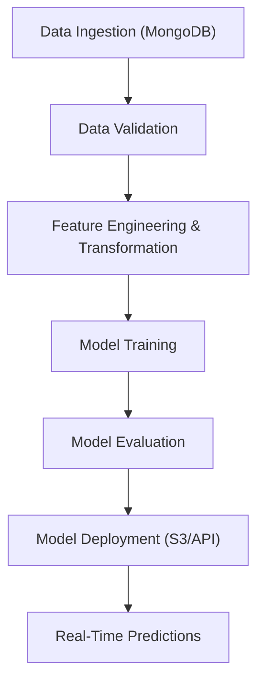

# MLOps: Vehicle Insurance Prediction Pipeline

Robust, production-ready machine learning pipeline for **Vehicle Insurance Prediction**, integrated with **MongoDB**, **AWS**, **Docker**, and **CI/CD via GitHub Actions**. This project highlights **end-to-end MLOps practices**, from ingestion to deployment, making it perfect for showcasing real-world engineering skills.

---

## 📌 Key Features

- 📂 Auto-generated project structure using Python
- ☁️ MongoDB Atlas for scalable cloud-based data storage
- 📊 Data ingestion, validation, and transformation pipelines
- 🤖 Model training, evaluation, and deployment to AWS S3
- 🧪 Exception handling, logging, and config management
- 🚀 CI/CD automation via GitHub Actions + Docker + AWS EC2
- 🧾 Real-time prediction API using FastAPI
- 📦 Virtual environment and dependency management
- 📈 Clean and modular architecture using OOP principles

---

## 🛠️ Installation & Setup

### Requirements
- Python 3.10+
- Conda / virtualenv
- MongoDB Atlas account
- AWS account (IAM + S3 + EC2)
- GitHub account for CI/CD

### Environment Setup

```bash
conda create -n vehicle python=3.10 -y
conda activate vehicle
pip install -r requirements.txt
```

Set your environment variables:

```bash
export MONGODB_URL="mongodb+srv://<username>:<password>@cluster.mongodb.net/"
export AWS_ACCESS_KEY_ID="your-access-key"
export AWS_SECRET_ACCESS_KEY="your-secret-key"
```

---

## 🚦 Quick Start

```bash
# 1. Create the project structure
python template.py

# 2. Run data ingestion pipeline
python demo.py

# 3. Train & evaluate model
python main.py

# 4. Deploy model (FastAPI or push to S3)
python app.py
```

> All outputs (logs, saved models, artifacts) are tracked in `artifacts/` and `logs/`.

---

## 🧠 Project Workflow



---

## 📦 Tech Stack

- **Backend**: Python, FastAPI
- **Data Storage**: MongoDB Atlas
- **Modeling**: Scikit-learn, Pandas
- **Deployment**: AWS S3, EC2
- **CI/CD**: GitHub Actions, Docker
- **Infra**: Linux, Bash scripting

---

## 📁 Folder Structure

```
├── src/
│   ├── components/
│   ├── config/
│   ├── entity/
│   ├── pipeline/
│   ├── utils/
├── templates/
├── static/
├── notebook/
├── logs/
├── Dockerfile
├── app.py
├── main.py
├── demo.py
```

---

## 🌐 Deployment

- Web app hosted on http://65.1.132.238:5000
- CI/CD setup using GitHub Actions and self-hosted EC2 runner

---

## 🚧 Roadmap

- [x] MongoDB data ingestion
- [x] S3 integration for model storage
- [x] FastAPI-based API for real-time inference
- [x] Dockerization
- [x] GitHub Actions CI/CD

---

## 🤝 Contributing

Pull requests are welcome! To contribute:

1. Fork the repo
2. Clone and set up environment
3. Submit a PR with clear description

---

## 📢 Acknowledgements

- Inspired by real-world MLOps practices
- MongoDB & AWS free-tier for scalable deployment
- Tools & tutorials from Krish Naik and freeCodeCamp
